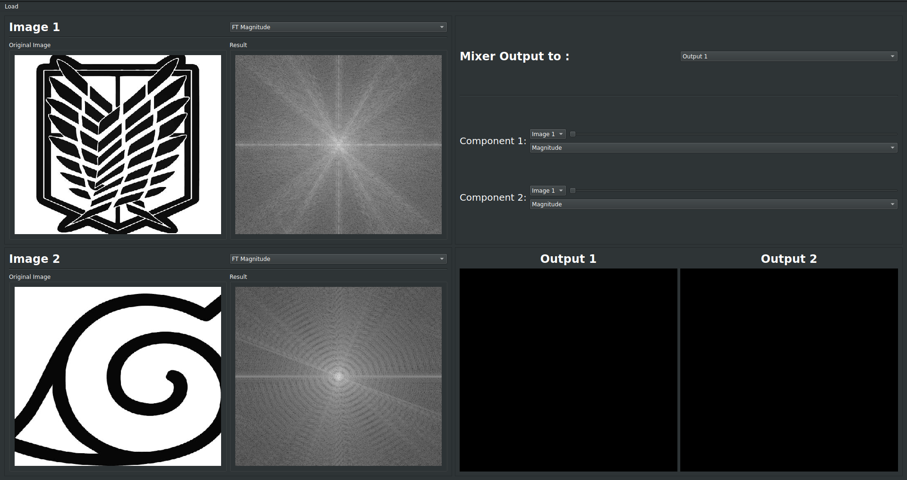
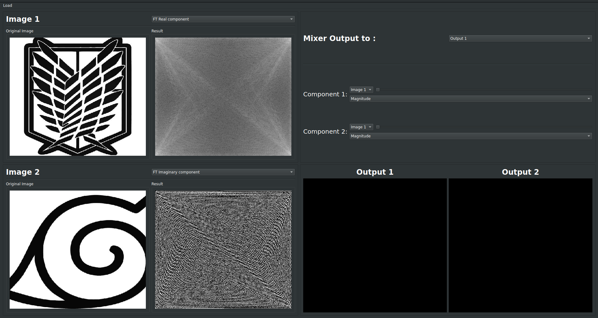
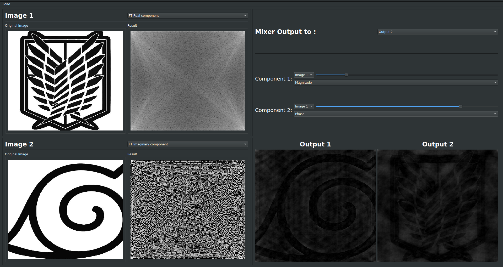
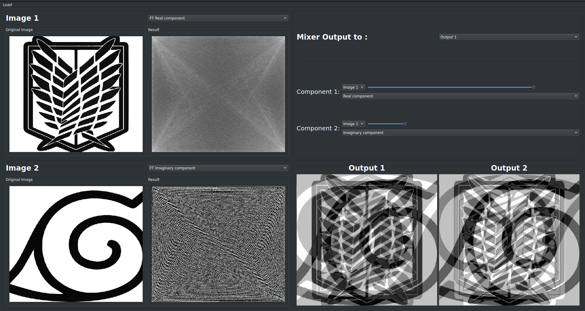

## Name: Ahmad Mahdy Mohammed

## ID: 9
-------------------------------------------------------------------------

# **Image Mixer**

## Purpose

* Visualizing components of image (Magnitude and Phase , Real and Imaginary).

* Mixing two images with different modes (mag and phase mode , complex mode) with different weights of every component.

* The visualization and mixing is automatic and works on the fly.

## How to use

1. Load two images.

2. Choose which component to view for each image from the comboBoxs.

3. Choose which output box to show in the mixer, each component and its weight.

## Screanshots

